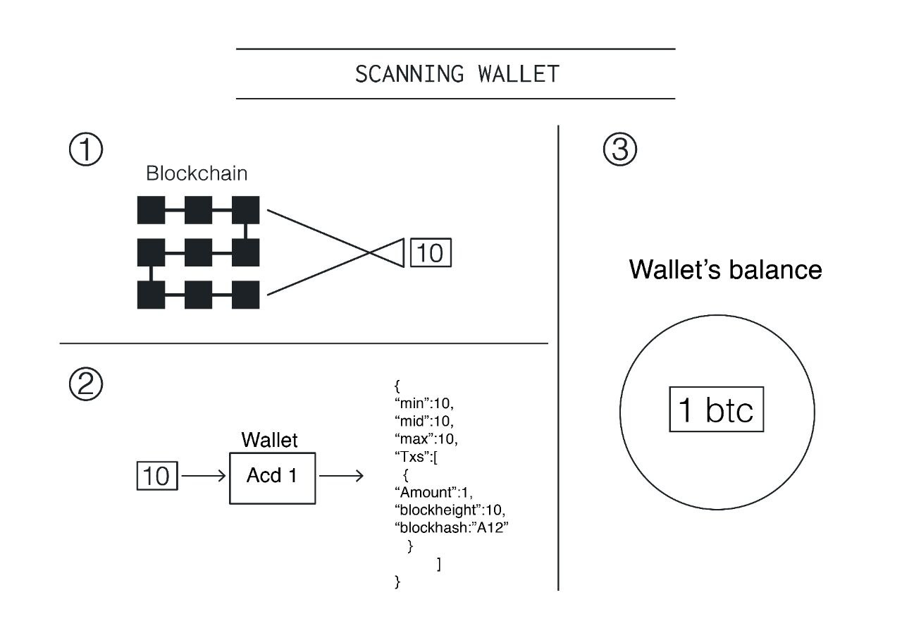

+++
title = "Scanning Wallet Standard"
tags = [
    "Wallet",
    "Wallets",
    "Scanning Wallets"
]
bounty = 5
date = "2018-01-03"
categories = [
    "Scanning Wallet",
]
+++

When scanning a wallet to see how much coins it has within its balance, there exists an standard scanning technique used by wallets (cryptocurrency wallets), it's a little bit slower but it has to take place to get the final balance. As you may know a wallet is a container of addresses, to get your wallet's balance you have to find each address, one by one within the blockchain and sum the coins' amount.

Each address within the wallet has a **minimun scan block**, **maximun scan block** and **middle scan block**.

**minimun scan block**: the lowest block height we have scanned for deposits to that address or the lowest block height when an address received a deposit.

**maximun scan block**: the highest block height we have scanned for deposits to that address or the highest block height when a address received its last deposit.

**middle scan block**: used for keeping check point. It helps scan in both side simultaneously. Middle increase only if minimun reach middle.

# How it works?

This process will take 3 simple and easily to understand steps.

### Step 1.
Scan the All blockchain by wallet to detect where deposits take place.

### Step 2.
Each wallet's address will be iterated one by one, looking for minimun, middle and maximus block where an address received a deposit.

### Step 3.
Take all those coins amounts and add them to the total balance.

